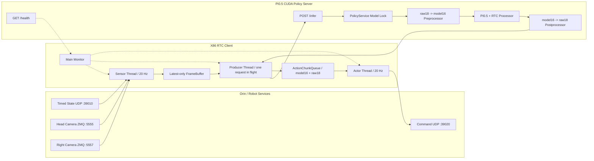

# PI0.5 RTC 异步推理架构方案

本文档描述当前 `tk_infer/pi05` 已经在 JZ Robot Pin Timed 机器人上实际运行的 PI0.5 RTC
异步推理架构。对应的上机启动命令见
[`PI05_010600_RTC_RUNBOOK.md`](./PI05_010600_RTC_RUNBOOK.md)。

## 1. 当前部署配置

```text
policy:            PI0.5
checkpoint:        tk_infer/pi05/checkpoints/010600/pretrained_model
checkpoint step:   10600/15900 (epoch 10/15, intermediate)
policy server:     PyTorch/CUDA HTTP server, 127.0.0.1:8088
robot state:       timed UDP, 0.0.0.0:39010
robot command:     UDP, 192.168.1.81:39020
head camera:       ZMQ, 192.168.1.81:5555, 1280x720
right camera:      ZMQ, 192.168.1.81:5557, 640x480
sensor FPS:        20
control FPS:       20
model chunk:       50 steps
RTC horizon:       10 steps
queue low water:   30
queue maximum:     50
empty strategy:    stop
```

当前 checkpoint 只接受 `camera_head` 和 `camera_right`，不会连接 `camera_left:5556`。

## 2. 架构目标

该架构解决以下问题：

1. GPU 推理期间，机器人动作不能暂停。
2. Sensor 应持续更新最新 observation，不能因为一次推理较慢而积压旧帧。
3. 新 action chunk 应考虑旧 chunk 中尚未执行的动作，减少 chunk 边界跳变。
4. 现场 raw18 数据边界和模型 model16 数据边界必须明确分离。
5. 推理延迟应转换为 action step，并在模型生成和客户端执行两侧共同补偿。
6. 队列耗尽、完全 stale chunk 或任一线程错误时必须 fail closed。

## 3. 总体拓扑



## 4. 三种客户端模式

| 客户端模式 | 客户端调度 | 服务端 wire mode | Action queue | RTC guidance |
| --- | --- | --- | --- | --- |
| `single_step` | 严格串行 | `single_step` | 否 | 否 |
| `async_single_step` | Sensor/Producer/Actor 三线程 | `single_step` | 是 | 否 |
| `rtc` | Sensor/Producer/Actor 三线程 | `rtc` | 是 | 是 |

`async_single_step` 和 `rtc` 都使用异步三线程客户端，但只有 `rtc` 会把 delay、model16 leftover
和 execution horizon 传给模型。

## 5. Sensor 线程

Sensor 按 `SENSOR_FPS=20` 执行：

```text
robot.get_observation()
  -> timed raw18 state
  -> camera_head
  -> camera_right
  -> observation processor
  -> latest-only FrameBuffer
```

FrameBuffer 只保存最新 observation。新帧到达时直接覆盖旧帧，不建立 observation FIFO，避免
Producer 在推理延迟后处理已经过期的图像。

每个 FrameSnapshot 包含：

```text
raw_observation
observation_frame
observation_timestamp_s
sequence_id
```

Producer 只接受比上一次更新的 sequence ID，避免重复请求同一帧。

## 6. Producer 线程

Producer 根据 action queue 深度决定是否请求新 chunk：

```text
queue depth > 30
  -> 等待，Actor 继续消费队列

queue depth <= 30
  -> 读取最新 FrameSnapshot
  -> 计算 predicted_delay_steps
  -> 读取 model16 prev_chunk_left_over
  -> 发送一个 RTC HTTP 请求
```

当前只允许一个 HTTP infer 请求在途。Producer 在等待 GPU 响应时会阻塞，但 Sensor 和 Actor
线程继续运行。

RTC 请求字段包括：

```text
request_id
mode=rtc
observation_frame
task
robot_type
obs_sequence_id
predicted_delay_steps
prev_chunk_left_over
execution_horizon=10
```

预测延迟使用历史请求 p95：

```text
predicted_delay_steps = ceil(p95_request_latency / control_dt)
control_dt = 1 / CONTROL_FPS = 0.05 s
```

## 7. 策略服务

服务端提供：

```text
GET  /health
POST /infer
```

每个 RTC 请求在同一个 `PolicyService` 模型锁内执行：

```text
observation_frame
  -> prepare_observation_for_inference
  -> checkpoint preprocessor
  -> PI0.5 predict_action_chunk with RTC kwargs
  -> checkpoint postprocessor
  -> InferenceResponse
```

服务端 HTTP 层可以接受并发连接，但模型锁会串行化 CUDA 推理。因此当前不是多请求并行 GPU
推理，也没有多个 CUDA stream inference pipeline。

## 8. raw18 与 model16 边界

现场 Robot 使用 raw18：

```text
14 joint values
left gripper width / force
right gripper width / force
```

checkpoint preprocessor 将 raw18 observation state 投影到 model16。PI0.5 输出 model16 action，
checkpoint postprocessor 再展开为 raw18，并把两个 force 槽写为 `80.0`。

服务端响应同时返回：

```text
raw_actions:       (50,16), model16
processed_actions: (50,18), raw18
```

两份数据用途不同：

```text
model16 raw_actions
  -> 保存为 RTC leftover
  -> 下一次请求传回模型
  -> 不发送给机器人

raw18 processed_actions
  -> 保存为执行队列
  -> Actor 构造 Robot action
  -> 通过 UDP 发送
```

不能把 postprocessed raw18 回传给 RTC，因为 RTC guidance 工作在模型的 model16 空间。

## 9. RTC 跨 chunk guidance

普通异步 chunk 的新旧关系是：

```text
old chunk A -> client queue
new chunk B -> 独立生成后替换 A
```

RTC 请求会携带：

```text
最新 observation
+ 旧队列尚未执行的 model16 leftover
+ predicted inference delay
+ execution horizon
```

PI0.5 RTC processor 在 denoising 阶段用这些信息引导新 chunk，使新动作尽量延续旧动作趋势。
RTC 改善的是跨 chunk 时间连续性，不是模型计算加速，也不是硬性动作滤波。

## 10. Response 合并和 stale drop

模型返回时，生成该动作的 observation 已经变旧。客户端计算：

```text
drop_steps = ceil((response_ready_time - observation_time) / control_dt)
```

然后丢弃新 chunk 前面的 stale prefix：

```text
processed queue = processed_actions[drop_steps:]
raw leftover    = raw_actions[drop_steps:]
```

当前 50-step chunk 在稳定状态下一般丢弃 4–5 步，剩余约 45–46 步。新 chunk 会替换当前队列，
而 RTC 模型层 guidance 负责降低替换边界的不连续。

## 11. Actor 线程

Actor 按 `CONTROL_FPS=20`，每 50 ms 执行：

```text
ActionChunkQueue.pop_processed_action()
  -> raw18 tensor validation
  -> Robot action dictionary
  -> robot.send_action()
  -> command UDP 192.168.1.81:39020
```

当 Producer 等待约 190 ms 的模型推理时，Actor 仍会发送约 4 条旧队列动作：

```text
GPU inference starts
  50 ms: Actor sends action N
 100 ms: Actor sends action N+1
 150 ms: Actor sends action N+2
 200 ms: Actor sends action N+3
new RTC chunk arrives and refills queue
```

因此机器人动作发送不会因一次 GPU 推理而暂停。

## 12. RobotIO 并发边界

Sensor 和 Actor 共用同一个 Robot 实例：

```text
Sensor -> robot.get_observation()
Actor  -> robot.send_action()
```

`SerializedRobotIO` 使用 `RLock` 串行化 Robot API 调用。线程调度是异步的，但对同一个 Robot
对象的关键访问保持互斥，避免 observation 读取和 action 发送破坏驱动器内部状态。

ActionChunkQueue 和 FrameBuffer 也使用独立锁保护共享状态。

## 13. Main Monitor

主线程负责：

```text
每 2 秒输出 runtime metrics
接收 Ctrl+C
监测任一线程错误
向所有线程发送停止信号
等待 Sensor/Producer/Actor 退出
断开 Robot
写入 client_summary.json
```

指标字段包括：

```text
sensor
actor
sent
requests
queue
request_ms
p95_ms
server_ms
drop
pred_delay
```

## 14. Fail-closed 行为

当前配置：

```text
EMPTY_QUEUE_STRATEGY=stop
FULLY_STALE_CHUNK_LIMIT=3
FIRST_CHUNK_TIMEOUT_S=60
REQUEST_TIMEOUT_S=120
```

以下情况会停止 runtime：

- 首个 action chunk 超时；
- 默认策略下 action queue 为空；
- 连续三个 chunk 在返回时已经完全 stale；
- HTTP request/response 校验失败；
- state、camera、RobotIO 或任一线程抛出异常；
- 达到 `RUN_TIME_S` 或 `MAX_SENT_ACTIONS`；
- 用户按 `Ctrl+C`。

物理急停可以停止机器人运动，但不保证自动终止 X86 客户端。按下急停后仍需在客户端终端按
`Ctrl+C`，停止后续动作请求。

## 15. 当前实测运行指标

一次约 3.1 分钟的实际 RTC armed 运行得到：

```text
sensor ticks:          3731
actor ticks:           3731
sent actions:          3718
inference requests:    196
sensor frequency:      approximately 20 Hz
actor frequency:       approximately 20 Hz
inference frequency:   approximately 1.05 requests/s
steady request latency:177-227 ms
steady server latency: 173-221 ms
queue depth:           27-46
drop steps:            4-5
predicted delay:       5 after warmup
queue empty:           not observed
fully stale chunk:     not observed
```

启动阶段的首帧冷推理 p95 约为 633 ms，因此初始 `predicted_delay_steps=13`。模型热身后 p95
下降到约 210 ms，RTC 自动调整为 `predicted_delay_steps=5`。

这些指标说明当前 Sensor、Producer、Actor 调度稳定，Actor 没有因模型推理阻塞而掉速，队列补充
周期符合 low-watermark 设计。

## 16. 当前架构中“异步”的准确含义

当前已经实现：

```text
Sensor 采集与模型推理并行
Actor 动作执行与模型推理并行
Sensor 采集与 Actor 动作执行并行调度
```

当前没有实现：

```text
多个 GPU inference 请求并行
多个 CUDA stream 推理 pipeline
多个 Producer 请求同时在途
```

因此当前架构应描述为：

> 单请求串行 GPU 推理，加上异步 Sensor/Producer/Actor 客户端，以及 PI0.5 RTC 跨 chunk
> guidance。

## 17. 已知边界

- RTC 改善动作时间连续性，但不能解决训练数据分布不足或视觉泛化问题。
- 约 190 ms 稳态推理延迟意味着新 chunk 通常需要丢弃 4–5 个 action step。
- 当前运行命令关闭 initial/per-step joint-delta 检查，RTC 本身不是硬性动作限速器。
- UDP command 没有应用层 ACK，`sent` 只表示动作已交给 UDP sender。
- `camera_left` 不在当前 checkpoint 输入中，不能在不重新训练的情况下直接加入。
- `n_obs_steps=1`，模型没有跨 observation 的视觉历史，RTC leftover 只提供动作历史约束。
